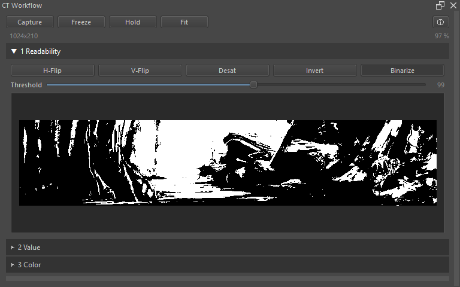
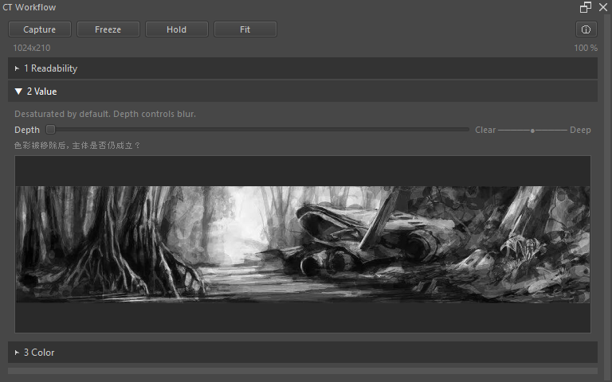
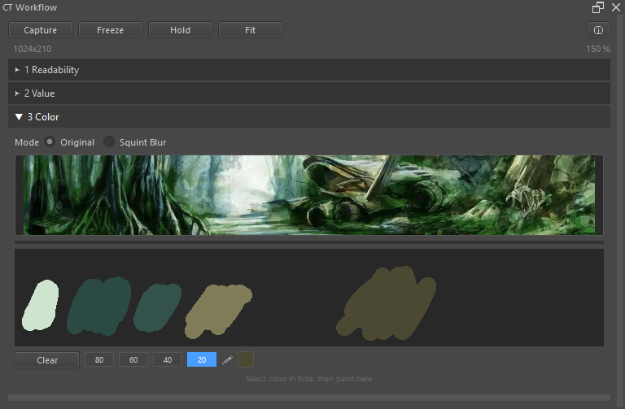

# CT Workflow — Krita Docker Plugin

A lightweight canvas thumbnail preview panel for Krita with real-time effects across **Readability**, **Value**, and **Color** observation.

Built for speed and stability — handles 4K+ documents without lag.

---

## Why

CT Workflow is designed as a visual self-check tool for painters and concept artists.

Instead of judging composition quality, it helps artists quickly inspect:

- **Readability** — mass grouping, silhouette separation, visual balance, attention flow
- **Value** — value readability, squint simulation, depth hierarchy
- **Color** — color harmony, squint blur observation, palette mixing

through simple transformations like flip, desaturation, inversion, binarization, and squint blur.

The goal is not evaluation.

The goal is visibility.

---

## Features

### Three Observation Stages (Accordion)

Only one stage expanded at a time. Zooming a preview does not shift the other stage headers.

| Stage | Purpose | Effects |
|---|---|---|
| **Readability** | Composition readability check | H-Flip, V-Flip, Desaturate, Invert, Binarize + Threshold |
| **Value** | Value organization & squint | Auto-desaturate, Depth slider (0–8) for squint blur |
| **Color** | Color harmony & mixing | Original / Squint Blur, **Palette Board** freehand paint |

### Palette Board (Color Tab)

- **Freehand paint** — brush strokes on a fixed-height canvas (120px), width expands with panel
- **Krita color sync** — auto-reads Krita foreground color for painting
- **Shift+click pick** — pick any color from the Board and sync it back to Krita foreground
- **Brush size buttons** — 4 fixed sizes (80 / 60 / 40 / 20 px), mutually exclusive
- **Color indicator** — live sync with Krita foreground color (polled, updates automatically)
- **Freeze / Hold** — snapshot the Board canvas alongside the preview for comparison
- **Clear** — one-click reset

### Shared Controls

- **Capture** — Snapshot current canvas for CT inspection
- **Freeze** — Lock current preview + Board state
- **Hold** — Momentarily compare frozen snapshot against live view
- **Mouse Wheel** — Zoom preview **20%–500%** (observation distance, not navigator magnification)
- **Scrub Zoom** — Press-and-drag horizontally on the preview to zoom in/out. Cursor changes to a magnifying glass (+ / − while dragging)
- **Fit** — Reset zoom to fit panel
- **Resize bars** — Custom 8px grip on right and bottom edges

### Pen / Tablet Scrub Zoom

| Input device | Trigger |
|---|---|
| Mouse / touch | **Press** on preview → **drag horizontally** |
| Pen (Windows Ink) | **Pen tip down** on preview → **drag horizontally** |
| Pen (Wintab / Wacom) | **Hold Spacebar** → **drag pen horizontally** on preview |

Wintab drivers on Windows bypass the OS mouse layer, so the pen tip alone cannot be detected inside a Krita docker. The **Spacebar** fallback uses the keyboard subsystem, which Krita does not intercept.

> **Tip**: Keep the Spacebar held while dragging; release it when you reach the desired zoom.

---

## Quick Install

> **Note for developers**: Krita loads from `%APPDATA%\krita\pykrita\` (Windows), not from your git clone. After editing files, copy them to the Krita path and restart Krita.

### Windows (One-Liner)

```powershell
$dest = "$env:APPDATA\krita\pykrita"; New-Item -ItemType Directory -Force -Path $dest | Out-Null; Copy-Item -Recurse -Force "ct_navigator.desktop","ct_navigator" $dest
```

### Manual (All Platforms)

Copy `ct_navigator.desktop` and the `ct_navigator/` folder into Krita's **pykrita** directory:

| OS | Path |
|---|---|
| **Windows** | `%APPDATA%\krita\pykrita\` |
| **Linux** | `~/.local/share/krita/pykrita/` |
| **macOS** | `~/Library/Application Support/Krita/pykrita/` |

Expected result:

```
pykrita/
  ct_navigator.desktop
  ct_navigator/
    __init__.py
    docker.py
    effects.py
    palette_board.py
    utils.py
```

### Enable

1. **Restart Krita**
2. **Settings > Configure Krita > Python Plugin Manager** → check **CT Workflow**
3. **Restart Krita again**
4. **Settings > Dockers > CT Workflow** to show the panel

---

## Usage

### Readability Stage



| Control | Action |
|---------|--------|
| **Capture** | Snapshot current canvas |
| **H-Flip** | Mirror preview horizontally |
| **V-Flip** | Mirror preview vertically |
| **Desat** | Grayscale (luminance) |
| **Invert** | Negative / invert colors |
| **Binarize** | Black & white with threshold slider |
| **Freeze** | Lock current preview state |
| **Hold** | Flick compare frozen vs live |

### Value Stage



| Control | Action |
|---------|--------|
| **Depth** | 0 = clear desaturated, 8 = deep squint blur |

### Color Stage



| Control | Action |
|---------|--------|
| **Mode** | Original / Squint Blur |
| **Board click** | Paint with current Krita foreground color |
| **Board Shift+click** | Pick Board color → sync to Krita foreground (🖉 icon tooltip) |
| **Brush buttons** | 80 / 60 / 40 / 20 px (mutually exclusive) |
| **Color indicator** | Live Krita foreground color preview |
| **Clear** | Reset Board canvas |
| **Freeze / Hold** | Snapshot and compare Board + preview |

---

## CT Workflow

```
Painting
  ↓
Capture
  ↓
Readability CT Inspection (Flip / Invert / Binarize)
  ↓
Value CT Inspection (Desaturate + Squint Depth)
  ↓
Color CT Inspection (Squint Blur / Palette Board Mixing)
  ↓
Freeze
  ↓
Continue Painting
  ↓
Hold (flick compare)
  ↓
Judge drift across Readability / Value / Color
```

---

## What CT Workflow Is NOT

CT Workflow is **not** a live navigator.

It is a **snapshot-based structure inspection tool**.

The preview updates only when the user explicitly clicks **Capture**.

This preserves:

- inspection stability
- structure freezing
- flick-comparison consistency
- low-overhead performance

---

## Performance Notes

- **Large documents**: A 4K canvas is pre-scaled to ≤1024 px before any effect runs, so toggling effects stays instant.
- **Rendering pipeline**: Scale first → apply effects on the small thumb → display. No full-resolution pixel loops.
- **Invert**: Uses `QImage.invertPixels()` (C++ native), zero Python overhead.
- **Desaturate / Binarize**: Use `bytearray` batch ops instead of slow `pixel()` / `setPixel()`.
- **Resize**: Debounced at 100 ms; dragging the panel edge does not spam redraws.
- **Board canvas**: Fixed 120px height, dynamic width; resize preserves content via top-left align (no stretch).
- **Scrub zoom**: Polls at 50 fps with a 5 px dead-zone and 3% zoom threshold to suppress frame-to-frame jitter.

---

## File Structure

```
ct_navigator/
  ct_navigator.desktop       # Plugin metadata
  ct_navigator/
    __init__.py              # Entry point (registers Docker)
    docker.py                # Panel UI, tabs, capture, zoom, resize, freeze/hold
    effects.py               # Fast pixel effects (batch byte ops + native invert)
    palette_board.py         # Freehand paintable board with Krita color sync
    utils.py                 # Logging & helpers
```

---

## Known Limitations

- **Wintab pen taps on toolbar buttons** (Capture / Freeze / Hold) may occasionally miss because Wintab events are not always converted to Qt mouse events inside Krita. Mouse clicks remain fully responsive.

## Compatibility

- **Krita 5.2+**
- **Python 3.10+** (bundled with Krita)
- **PyQt5** (bundled with Krita)
- No external dependencies
